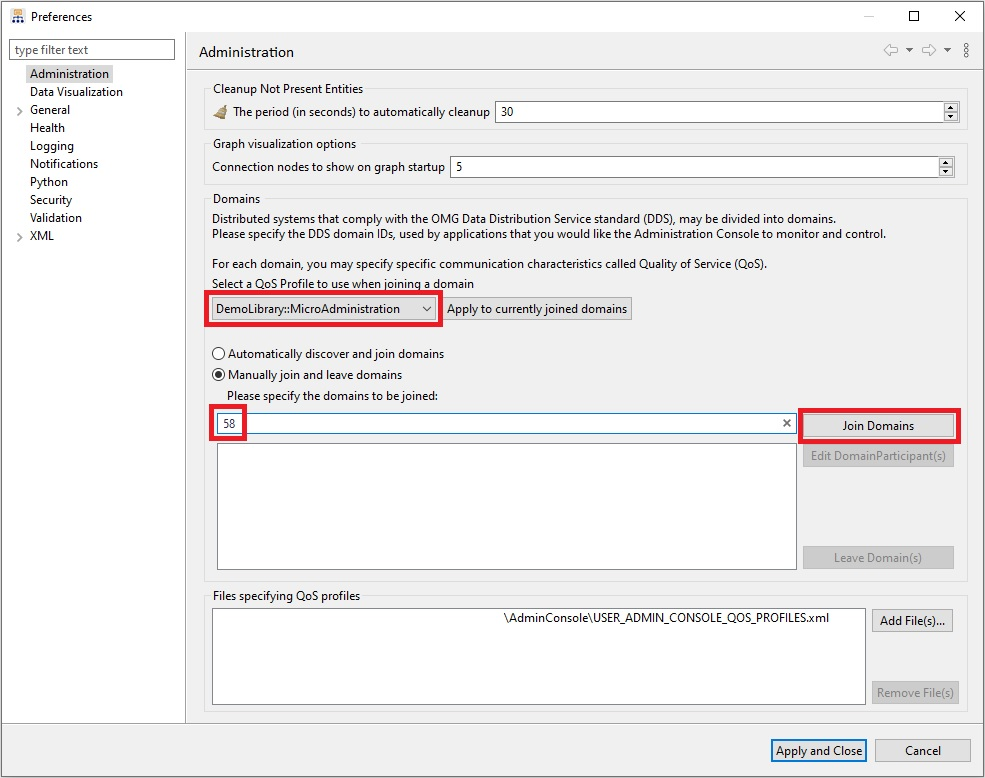
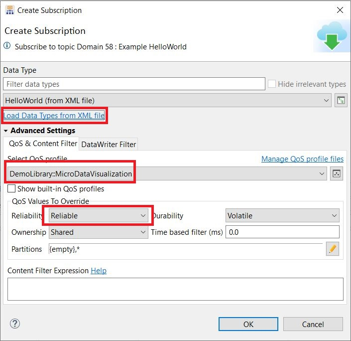

# Admin Console

In this directory you will find an example that illustrates how to
configure Admin Console to use the Limited Bandwidth Endpoint 
Discovery Plugin and subscribe to data sent by either of the
following:

 - a Connext Micro application configured with DPSE discovery.
 - a Connext Core application configured with the Limited Bandwidth
   Endpoint Discovery Plugin.

The file USER_ADMIN_CONSOLE_QOS_PROFILES.xml contains the configuration needed; see
the profile "MicroAdministration" in that file. By default, it allows only the use of 
the loopback interface (127.0.0.1). This is done to prevent resource exhaustion
in Connext Micro applications. You can update this with the interface name or IP address
that you wish to use. You may also want to update the initial peers which are used
for discovery; see the XML tag "initial_peers".

## How to Join Domains

Before starting Admin Console, you will need to update the path to the file with the
Endpoint configuration. Open the file USER_ADMIN_CONSOLE_QOS_PROFILES.xml and set
the correct path to the file EndpointDiscoveryInfo.xml, such as:

```xml
<element>
    <name>  dds.discovery.endpoint.lbediscovery.config_file </name>
    <value>C:\shared\github_repos\micro_dpse_vs_core_tools\AdminConsole\EndpointDiscoveryInfo.xml</value>
 </element>
```

Once you have updated the path, you can open Admin Console and click on the "Preferences"
button or select the menu View->Preferences. You will see the following pop-up
window:



In order to join the domain with the correct configuration:

- Click on the "Add File(s)..." button and select file
  USER_ADMIN_CONSOLE_QOS_PROFILES.xml in this folder.
- Select the QoS profile "DemoLibrary::MicroAdministration".
- Enter the domain id that you want to use. In the image above, we use 58.
- Click the "Join Domains" button and finally click on the "Apply and Close"
  button.

## Run the Publisher Application

You can now run the publisher application. You can use the publisher based 
on RTI Connext Micro found in the folder "connext_micro" or the
publisher based on RTI Connext Core libraries found in the folder
"connext_core".

See the documentation in these folders for information on how to compile 
and run the applications.

## Subscribe to Topic

To subscribe to the "Example HelloWorld" Topic in Admin Console, right
click in the "Example HelloWorld" Topic and in the pop-up menu select option
"Subscribe". You will see the following pop-up window:



In this window:

- Click on "Load Data Types from XML file" and select the file "HelloWorld.xml"
  in the root folder.
- Select the QoS profile "DemoLibrary::MicroDataVisualization".
- Set the reliability as "Reliable".

Once you click the "OK" button, Admin Console will subscribe to the topic and
you should see the data. If you want to see the individual samples being published,
right click in the Topic name ("Example HelloWorld") and in the pop-up menu
select Visualize->Sample Log.
