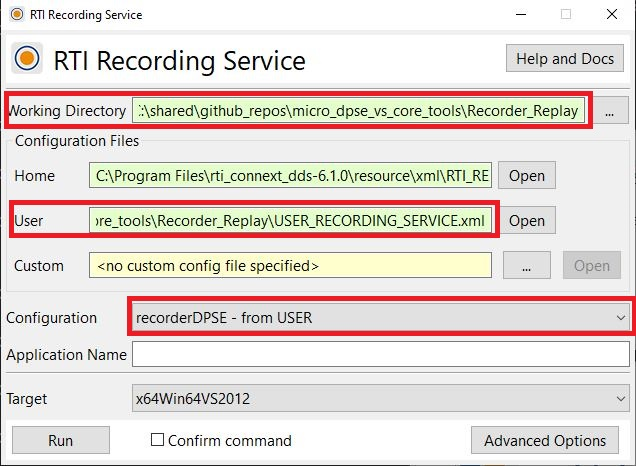
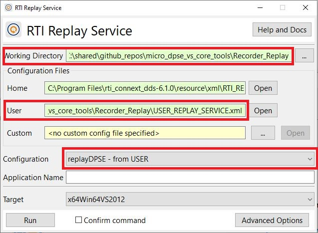

# Recording and Replay Service

In this directory you will find an example that illustrates how to
configure RTI Recording and Replay to use the Limited Bandwidth Endpoint
Discovery Plugin and record and replay data sent and received by either
of the following:

 - a Connext Micro application configured with DPSE discovery.
 - a Connext Core application configured with the Limited Bandwidth Endpoint
   Discovery Plugin.

For more information about Recording Service, please refer to the [User's Manual](https://community.rti.com/static/documentation/connext-dds/6.1.0/doc/manuals/connext_dds_professional/services/recording_service/recorder/record_index.html).

For more information about Replay Service, please refer to the [User's Manual](https://community.rti.com/static/documentation/connext-dds/6.1.0/doc/manuals/connext_dds_professional/services/recording_service/replay/replay_index.html).

## Run the Publisher Application and Subscriber Applications

You can use the publisher and subscriber based on RTI Connext Micro
found in the folder "connext_micro" or the publisher based on RTI Connext
Core libraries found in the folder "connext_core". See the 
documentation in these folders for information on how to compile and run 
the applications.

## How to Run Recording Service

In the RTI Connext Launcher "Services" tab, click the icon with
the name "Recording Service" and you will see the following window:



Before running Recording Service:

- Click on the "..." button next to the working directory field and 
  select this directory.
- Because a file with the name USER_RECORDING_SERVICE.xml is found in this 
  directory, the user configuration field will automatically update to show
  "<this git repository>/Recording_Replay/USER_RECORDING_SERVICE.xml".
- Select the configuration "recorderDPSE - from USER".

Once you click the "Run" button, Recording Service will be executed in a new window.
It will start recording all information published by the publisher application.

Alternatively, you can also run Recording Service using the same configuration as
the previous example with the following commands:

```console
cd <this git repository>/Recorder_Replay

rtirecordingservice.bat -cfgName recorderDPSE 
```

As configured in file USER_RECORDING_SERVICE.xml, Recording Service will record 
data in the subdirectory "cdr_recording".

You can record some data and stop the publisher application and Recording Service
after some time.

## How to Run Replay Service

In the RTI Connext Launcher "Services" tab, click the icon with
the name "Replay Service" and you will see the following window:



Before running Replay Service:

- Click on the "..." button next to the working directory field and select 
  this directory.
- Because a file with the name USER_REPLAY_SERVICE.xml is found in this 
  directory, the user configuration field will automatically update to show
  "<this git repository>/Recording_Replay/USER_REPLAY_SERVICE.xml".
- Select the configuration "replayDPSE - from USER".

Once you click the "Run" button, Replay Service will be executed in a new window. 
It will start replaying all information previously recorded by Recording Service.
The subscriber application will receive this information.

Alternatively, you can also run Replay Service using the same configuration as
the previous example with the following commands:

```console
cd <this git repository>/Recorder_Replay

rtireplayservice.bat -cfgName replayDPSE
```
