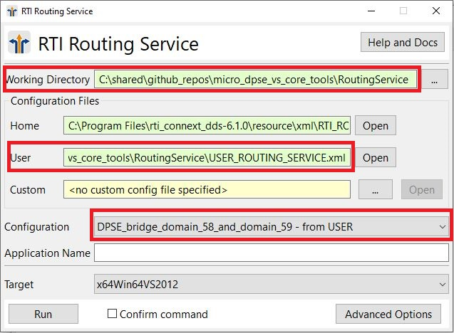

# Routing Service

In this directory you will find an example that illustrates how to
configure RTI Routing Service to use the Limited Bandwidth Endpoint
Discovery Plugin. This example routes the Topic "Example HelloWorld" 
from domain 58 to domain 59 when both the publisher and the subscriber 
applications are configured to use DPSE discovery.

For more information about Routing Service, please refer to the [User's Manual](https://community.rti.com/static/documentation/connext-dds/7.1.0/doc/manuals/connext_dds_professional/services/routing_service/index.html).

## Run the Publisher and Subscriber Applications

You can use the publisher and subscriber based on RTI Connext Micro found
in the folder "connext_micro" or the publisher and subscriber based on RTI Connext
Core libraries found in the folder "connext_core". See the 
documentation in these folders for information on how to compile and run 
the applications.

<b>It is important that you run the publisher application in domain 58 and the
subscriber application in domain 59.</b> This is because the Routing Service
configuration in file USER_ROUTING_SERVICE.xml uses these domain ids. You can
change this configuration if you prefer to use different domain ids.

## How to Run Routing Service

In the RTI Connext Launcher "Services" tab, click the icon with
the name "Routing Service" and you will see the following window:



Before running Routing Service:

- Click the "..." button next to the the working directory field and select 
  this directory.
- Because a file with name USER_ROUTING_SERVICE.xml is found in this directory,
  the user configuration will automatically update to show
  "<this git repository>/RoutingService/USER_ROUTING_SERVICE.xml".
- Select the configuration "DPSE_brige_domain_58_and_domain_59 - from USER".

Once you click the "Run" button, Routing Service will be executed in a new window.
The subscriber application will start receiving samples.

Alternatively, you can also run Routing Service using the same configuration as
the previous example with the following commands:

```console
cd <this git repository>/RoutingService

rtiroutingservice -cfgName DPSE_bridge_domain_58_and_domain_59
```
