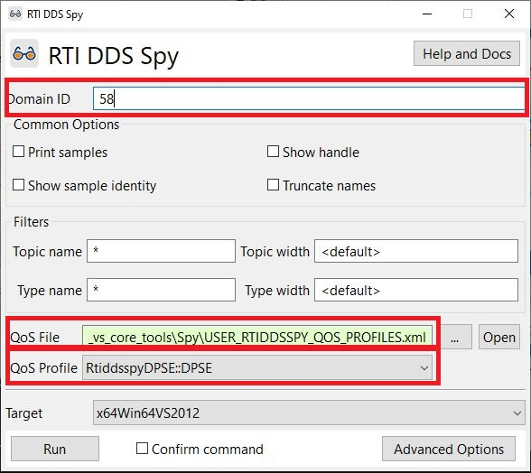

# RTI DDS Spy

In this directory you will find an example that illustrates how to
configure RTI DDS Spy to use the Limited Bandwidth Endpoint Discovery
Plugin and subscribe to data sent by a:

 - Connext Micro application configured with DPSE discovery.
 - Connext Core application configured with the Limited Bandwidth
   Endpoint Discovery Plugin.

For more information about RTI DDS Spy please refer to the [documentation](https://community.rti.com/static/documentation/connext-dds/6.1.0/doc/api/connext_dds/api_cpp/group__DDSNddsspyModule.html).

The file USER_RTIDDSSPY_QOS_PROFILES.xml contains the configuration needed,
see profile "DPSE" in that file. By default it allows only the use of the loopback
interface (127.0.0.1). This is done to prevent resource exhaustion in Connext
Micro applications. You can update this with the interface name or IP address
that you wish to use. You might also want to update the initial peers which are used
for discovery, see XML tag "initial_peers".


## Run the Publisher Application

You can use the publisher based on RTI Connext Micro and you can find it in
folder "connext_micro" or the publisher based on RTI Connext Core libraries
and you can find it in folder "connext_core". See the documentation in these
folders to know how to compile and run the applications.

## How to Run DDS Spy

Before starting Spy you will need to update the path to the file with the
Endpoint configuration. Open file USER_RTIDDSSPY_QOS_PROFILES.xml and set
the correct path to the file SpyEndpointDiscoveryInfo.xml, i.e.:

```xml
<element>
    <name>  dds.discovery.endpoint.lbediscovery.config_file </name>
    <value>C:\shared\github_repos\micro_dpse_vs_core_tools\Spy\SpyEndpointDiscoveryInfo.xml</value>
 </element>
```

In the RTI Connext Launcher, in the tab with name "Utilities", click the icon with
the name "DDS Spy" and you will see the following window:



Before running Spy you need to perform the following actions:

- Click button with name "..." and select the file USER_RTIDDSSPY_QOS_PROFILES.xml
  in this folder.
- Select the QoS profile RtiddsspyDPSE::DPSE.
- Enter the domain id that you want to use, in the image above we use 58.

Once you click the "Run" button Spy will be executed in a new window and you will see
the samples being published from the publisher application.

Alternatively you can also run Spy using the same configuration as the previous example
with the following commands:

```console
cd <this git repository>/Spy

rtiddsspy -domainId 58 -peer 127.0.0.1 -qosFile USER_RTIDDSSPY_QOS_PROFILES.xml -qosProfile RtiddsspyDPSE::DPSE
```
